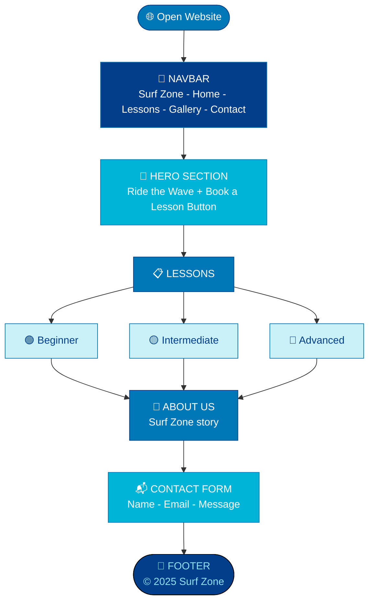

# 🏄 Surf Zone

> *Ride the Wave* — A bright beachy surfing website built with HTML & CSS.


---

## ✨ Features

- 🌊 Ocean blue gradient hero background
- 🏄 Surf lessons for all levels
- 🌅 About Us section
- 📬 Contact form
- 📌 Fixed footer

---

## 📁 Folder Structure
```
📁 surfing/
   ├── 📄 index.html
   └── 🎨 style.css
```

---

## 🔄 Page Flow


---

## 🏄 Lessons Offered

| Level | Description |
|-------|-------------|
| 🟢 Beginner | Learn basics and catch your first wave |
| 🟡 Intermediate | Improve balance and technique |
| 🔴 Advanced | Master big waves and sharp turns |

---

## 🎨 Design Details

| Feature | Detail |
|---------|--------|
| Background | Ocean blue gradient |
| Accent Color | `#0077b6` & `#023e8a` |
| Font | Georgia |
| Cards | White with blue shadow |

---

## ▶️ How to Run
```bash
1. Download both files
2. Keep index.html and style.css in same folder
3. Open index.html in browser
4. Surf's up! 🏄
```

---

> *Built with HTML & CSS only — no frameworks* 💪  
> © 2025 Surf Zone · Ride the Wave 🌊
